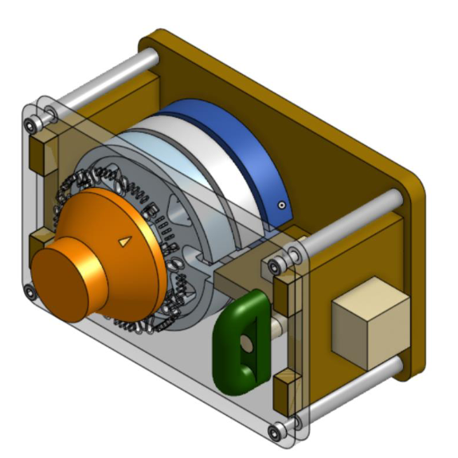
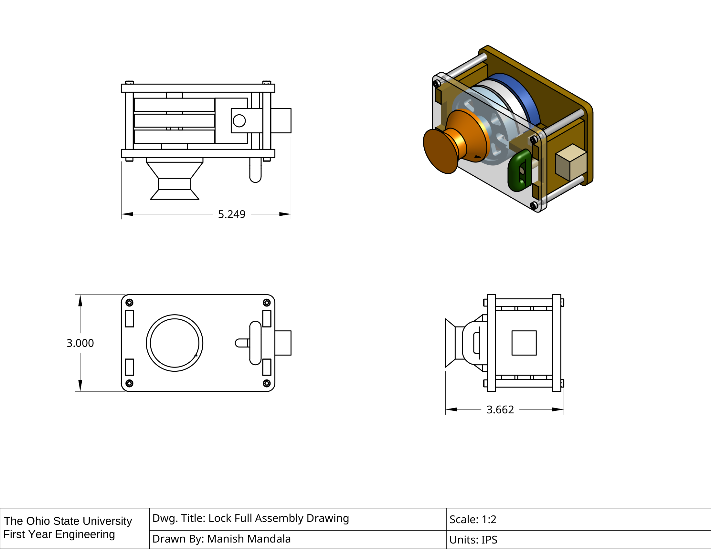
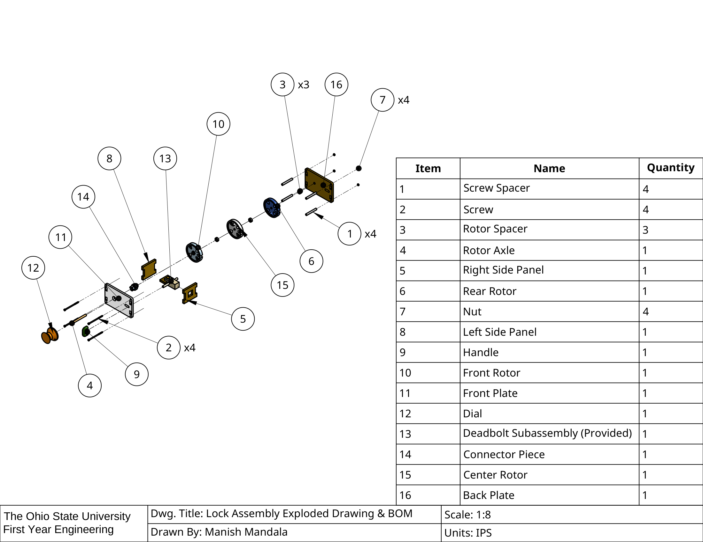
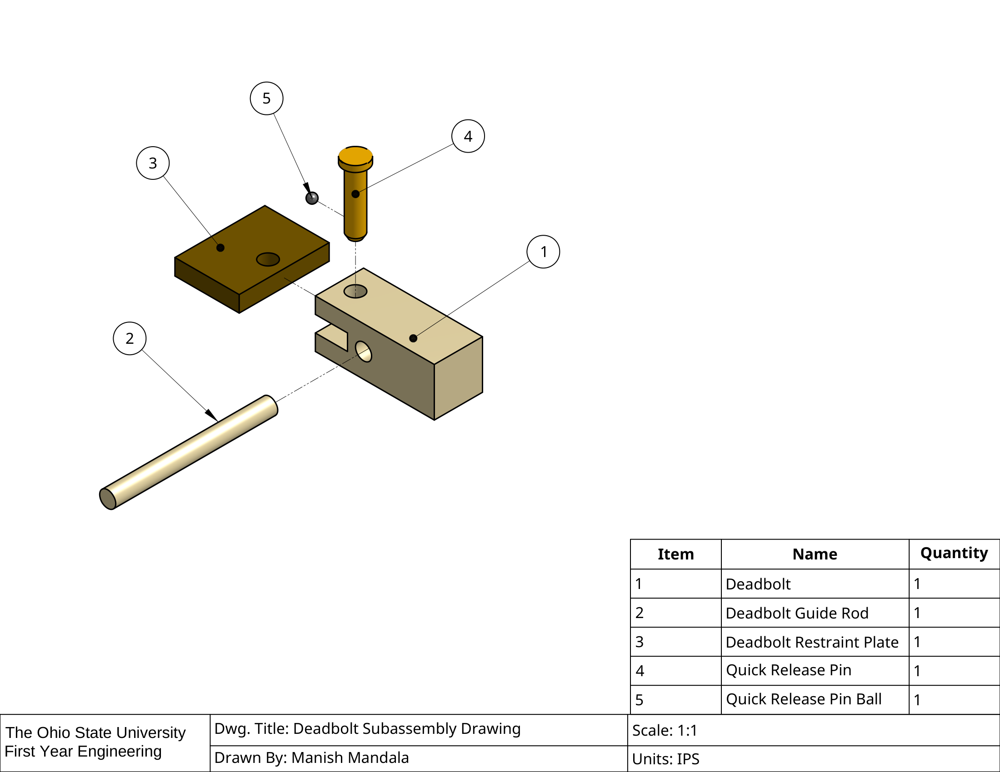
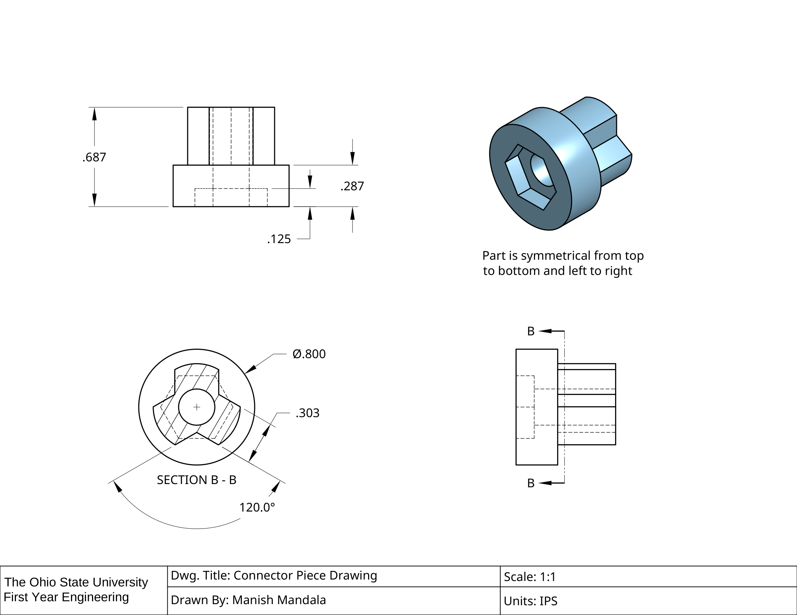
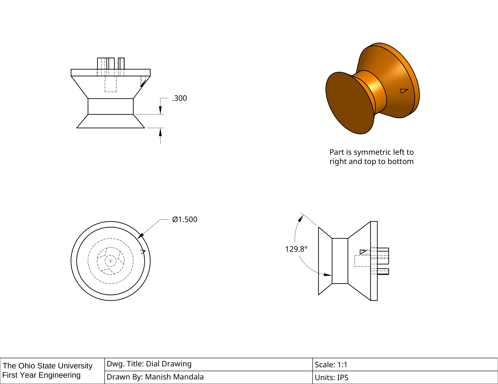

# Combination Lock

A working mechanical combination lock, designed in OnShape as part of Ohio
State's First Year Engineering program (Team G10). The mechanism uses three
rotors on a shared axle - each notched at a specific position - that only
align to release the deadbolt when the correct three-number combination is
dialed in.

The OnShape source file is no longer accessible, so this repo preserves the
finished technical drawings: full assembly, exploded view with a complete
bill of materials, and detail drawings of the custom-designed parts.

## Full assembly

## Exploded view & bill of materials

Sixteen parts total - three rotors, two side panels, front/back plates, a
handle, dial, connector piece, and the fasteners holding it together. Only
the deadbolt subassembly (item 13) was a provided part; everything else was
custom-designed.

## Deadbolt subassembly

Documentation of the provided deadbolt hardware's geometry, drawn to
integrate correctly with the custom rotor housing.

## Connector piece

Custom part linking the dial to the front rotor - a tri-lobed key that
transmits rotation from the dial into the rotor stack.

## Dial

The user-facing dial, symmetric front-to-back so it can be read from either
side, with an internal drive feature matching the connector piece.

## Course context

Built for Ohio State's ENGR 1182 (First Year Engineering) as a team project.
These drawings represent the individually-authored documentation for the
lock mechanism.
